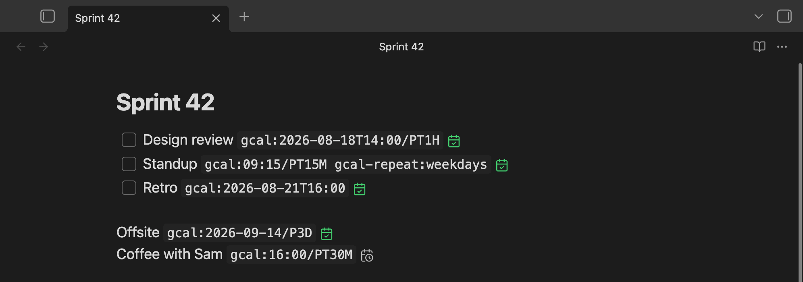
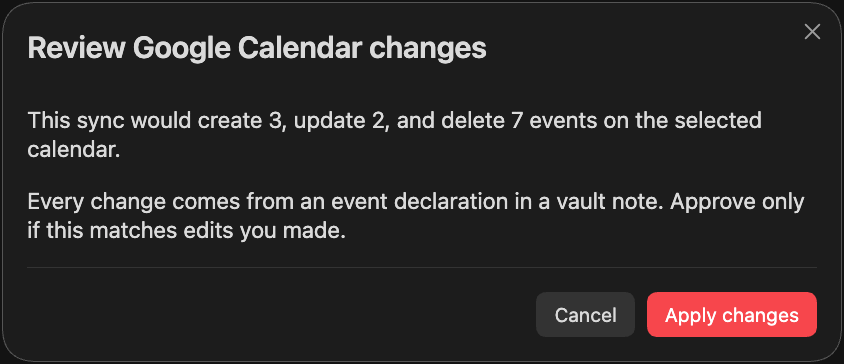

<div align="center">

# Google Calendar Sync for Obsidian

**Write an event in a note. It appears on your Google Calendar.**

[](https://github.com/mcuste/obsidian-gcal-sync/actions/workflows/ci.yml)
[](https://github.com/mcuste/obsidian-gcal-sync/releases)
[](https://obsidian.md)
[](LICENSE)



</div>

## How it works

Write `gcal:` in a code span on any line. The text before it becomes the event title.

```markdown
- [ ] Design review `gcal:2026-08-18T14:00/PT1H gcal-repeat:weekdays`
      ^^^^^^^^^^^^^       ^^^^^^^^^^^^^^^^ ^^^^             ^^^^^^^^
      title               start            duration         repeat
```

Save the note, and the plugin makes your calendar match it:

```
your notes ──> plugin compares ──> Google Calendar
                                   ├─ event missing    -> create
                                   ├─ event different  -> update
                                   └─ line gone        -> delete
```

- Sync goes one way. The plugin never edits your notes.
- It runs about a second after you save, every 15 minutes, when Obsidian starts, and when you run
  **Sync now**.
- It only touches events it created, so your other Google Calendar events are safe, even on the
  same calendar.

The icon after each line shows whether the event reached Google: a green tick means yes, a grey
clock means not yet, a red cross means something is wrong. See
[status markers](docs/event-syntax.md#status-markers).

## Syntax

There are two directives: `gcal:` for the event and `gcal-repeat:` to repeat it. Both go inside
backticks.

**Start and duration**, written as `gcal:<start>[/<duration>]`:

| You write | You get |
| --- | --- |
| `gcal:2026-08-18` | All-day event on that date |
| `gcal:2026-09-14/P3D` | All-day event over three days |
| `gcal:2026-08-18T14:00` | 14:00, one hour |
| `gcal:2026-08-18T14:00/PT90M` | 14:00, 90 minutes |
| `gcal:16:00/PT30M` | 16:00 today, 30 minutes, and it stays on that day |
| `gcal:2026-08-18T14:00-04:00` | An exact moment, whatever your time zone |

Times use your own time zone unless you add `Z` or an offset such as `-04:00`. Durations use `PnD`
for all-day events and `P#DT#H#M` for timed ones.

**Repeat**, written as `gcal-repeat:<rule>` after the event it belongs to:

| Kind | Rules |
| --- | --- |
| Periods | `daily`, `weekly`, `fortnightly`, `monthly`, `quarterly`, `yearly` |
| Weekdays | `weekdays`, `monday`, `mon,wed,fri`, `monday-thursday` |
| Intervals | `every-2-weeks`, `every-10-days`, `every-3-months` |
| Raw RRULE | `FREQ=MONTHLY;BYMONTHDAY=1` |

`gcal-repeat:` also works on its own. ``Take medication `gcal-repeat:daily` `` is an all-day event
that repeats from today.

**In note properties**, for when the note itself is the event. The note name is the title unless you
set one:

```yaml
---
gcal:
  - when: 2026-08-18T09:15/PT15M
    title: Standup
    repeat: weekdays
  - when: 2026-08-20/P1D
---
```

A code span only counts when it holds nothing but directives, so a note can write about `gcal:`
without creating an event. Everything you can write is in [Event syntax](docs/event-syntax.md).

## Setup

You need Obsidian 1.13.0 or newer on desktop, a Google account, and your own Google Cloud OAuth
client. The plugin ships no credentials of its own, so you create that client once, which takes a
few minutes. Desktop only, because signing in needs a local callback server.

1. Create an OAuth client of type **Desktop app** and turn on the Google Calendar API.
   [Setup](docs/setup.md) has the steps.
2. In **Settings → Google Calendar Sync**, put the client ID in an Obsidian secret and click
   **Authorize**.
3. Under **Calendar**, click **Create calendar**, so synced events stay separate from your other
   events.
4. Add `` `gcal:2026-08-18T14:00/PT1H` `` to a note and save.

## Guard rails

Any note in a synced folder can add or delete events, so large changes stop and ask first.



- Deleting 5 or more events, or changing 25 or more, waits for your approval.
- More than 200 changes in one sync is refused.
- If a note has a bad line, the whole note is skipped and its events are kept.
- **Synced folders** limits which folders may declare events.

More in [How sync works](docs/how-sync-works.md) and
[Security and privacy](docs/security-and-privacy.md).

## Network use

The plugin contacts Google and nothing else. There is no telemetry and no third-party server.

| Host | Why |
| --- | --- |
| `accounts.google.com` | Sign-in during authorization. |
| `oauth2.googleapis.com` | Exchange, refresh, and revoke your token. |
| `www.googleapis.com` | Read and write events on the Google Calendar API. |

Titles, times, and repeat rules are sent to Google. Note paths and folder names are hashed first,
and nothing else from your notes leaves your device.

## Documentation

- [Setup](docs/setup.md)
- [Event syntax](docs/event-syntax.md)
- [Settings](docs/settings.md)
- [How sync works](docs/how-sync-works.md)
- [Security and privacy](docs/security-and-privacy.md)
- [Troubleshooting](docs/troubleshooting.md)
- [Development and release](docs/development.md)
- [Changelog](CHANGELOG.md)

## License

[MIT](LICENSE)
