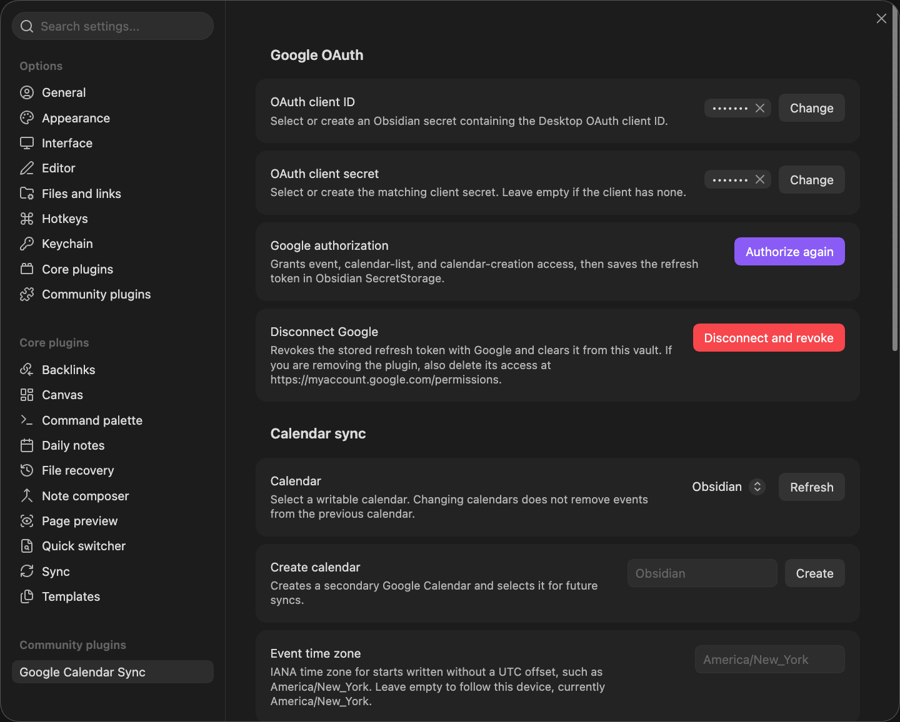
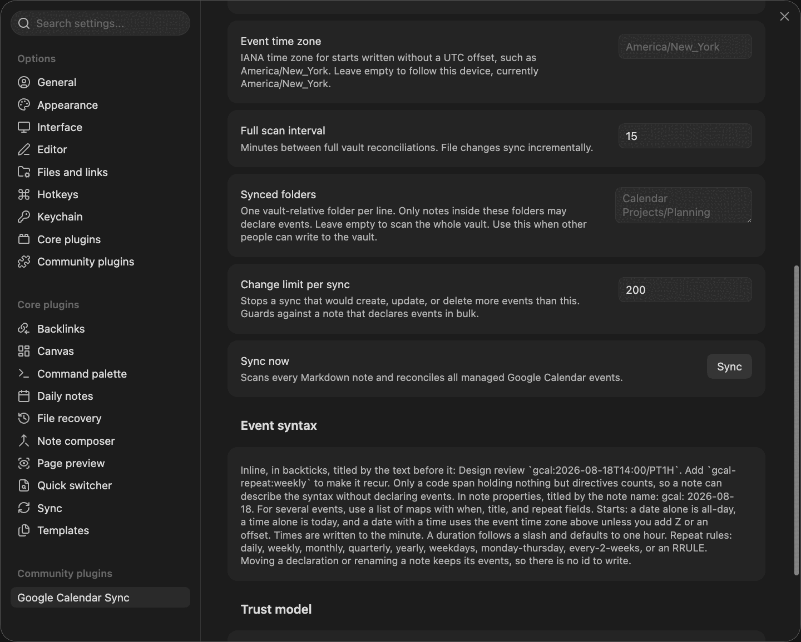

# Settings

Open **Settings → Google Calendar Sync**.

## Google OAuth

| Setting | What it does |
| --- | --- |
| **OAuth client ID**, **OAuth client secret** | Point at Obsidian secrets holding your Google Cloud Desktop client credentials. Leave the secret empty if your client has none. [Setup](setup.md) covers making them. |
| **Google authorization** | Starts sign-in. Your browser opens Google's consent screen while the plugin listens on a local callback port, and the refresh token goes into Obsidian's secret storage. While it runs, the button counts down and doubles as cancel. The attempt is dropped after 2 minutes, or when you leave the tab. |
| **Disconnect Google** | Appears once you are connected. **Disconnect and revoke** clears the token from the vault and revokes it with Google. See [Security and privacy](security-and-privacy.md#revoking-access). |
| **Calendar** | Lists every calendar you can write to. **Refresh** reloads the list. Switching calendars leaves events on the old one where they are. |
| **Create calendar** | Makes a new calendar and selects it. The easiest way to keep synced events apart from your everyday calendar. |

## Calendar sync

| Setting | What it does |
| --- | --- |
| **Event time zone** | The IANA zone used for starts written without `Z` or an offset, for example `America/New_York`. Empty follows this device. An unknown zone is rejected with a message under the setting. Changing it moves every event that has no offset of its own. [Rules](event-syntax.md#start-and-duration). |
| **Full scan interval** | Minutes between full vault syncs, default 15. Edits to single notes still sync within about a second. |
| **Synced folders** | Which notes may declare events, one vault-relative folder per line. Empty means the whole vault. Set it when anyone or anything other than you can write to the vault. |
| **Change limit per sync** | Caps how many events one sync may create, update, and delete, default 200. A sync above it stops without changing anything and reports the count, which protects you from a note or script that makes events in bulk. |
| **Sync now** | Runs a full sync straight away, the same as the **Sync now** command. The only way to approve changes waiting for review. |

The tab ends with two reference sections rather than settings: **Event syntax** sums up
[Event syntax](event-syntax.md), and **Trust model** repeats who can change your calendar, covered in
[Security and privacy](security-and-privacy.md#trust-model).

## Where settings live

Ordinary settings sit in `<vault>/.obsidian/plugins/gcal-sync/data.json`, including the vault ID that
marks which events belong to this vault. Credentials and the refresh token are kept in Obsidian's
secret storage, outside the vault.

The vault ID is a hash of the vault name, so a vault opened without that `data.json` still finds its
events instead of duplicating them. An ID already stored is left alone. Vaults with different names
stay separate on one calendar, so renaming a vault leaves its old events behind: sync once from the
old name first, or delete them in Google Calendar.
